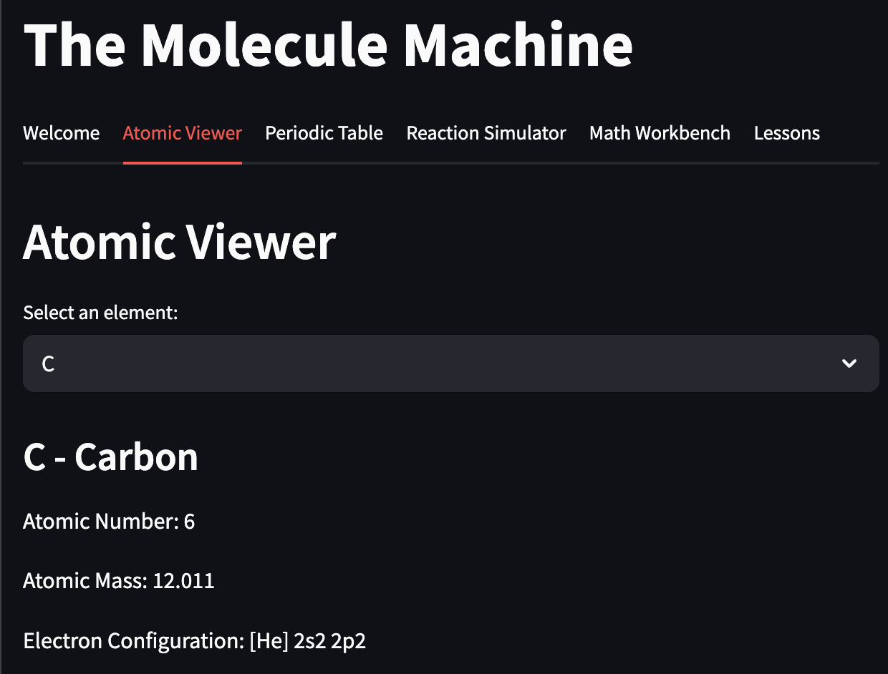

# The Molecule Machine

The Molecule Machine is an interactive Streamlit application designed to explore concepts in chemistry and molecular science. It provides modules for:

*   **Atomic Viewer:** Visualizing atoms and their properties.
*   **Periodic Table:** Exploring the periodic table of elements.
*   **Reaction Simulator:** Simulating chemical reactions.
*   **Math Workbench:** Tools for performing calculations relevant to chemistry.
*   **Lessons:** Educational content.

## Getting Started

To run this application:

1.  **Ensure you have Python and Streamlit installed.**

2.  **Recommended: Create and activate a virtual environment (venv):**

    ```bash
    python -m venv .venv
    source .venv/bin/activate  # Linux/macOS
    .venv\Scripts\activate   # Windows
    ```

3.  **Install dependencies:**

    ```bash
    pip install -r requirements.txt
    ```

4.  **Run the app:**

    ```bash
    streamlit run the_molecule_machine/app.py
    ```

    This will open the application in your web browser.



## License

This project is licensed under the MIT License - see the [LICENSE](LICENSE) file for details.
